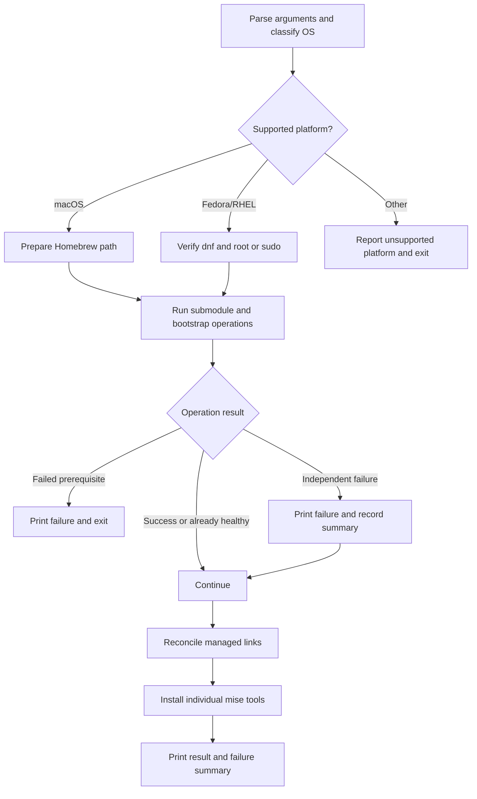

# Reliable, Portable install-dotfiles.sh - Plan

## Goal Capsule

- **Objective:** Make `bin/install-dotfiles.sh` the self-healing bootstrap and repair entrypoint for macOS and Fedora/RHEL systems, with safe dry-run visibility and explicit failure reporting.
- **Product authority:** Sole author and user of this dotfiles repo. No external stakeholders.
- **Open blockers:** None.

---

## Product Contract

### Summary

`bin/install-dotfiles.sh` will inspect real machine state on every run, repair safe-to-repair drift by default, and show the same intended changes without mutation under `--dry-run`. It will tolerate independent network/tool failures while stopping only for failed prerequisites, and will support Fedora/RHEL through `dnf` alongside the existing macOS/Homebrew path.

### Problem Frame

The installer is nominally re-runnable but does not reliably reconcile a machine back to the repo: its Ghostty, Zellij, and Alacritty blocks test different filesystem conditions, so dangling links, clobbered targets, and stale real directories are inconsistently handled. A single transient failure currently terminates the entire process because `set -euo pipefail` cannot distinguish a prerequisite from an independent step. The active install path also lacks Fedora/RHEL package handling, does not initialize the tracked Alacritty theme submodule, and cannot show an operator what a repair run would change before acting.

### Requirements

#### Self-healing and drift repair

- R1. Every symlink-creating block uses one consistent health check, so a missing, dangling, or wrong-target link is detected and reconciled on every run.
- R2. The `config/alacritty/themes` Git submodule is initialized early, before any dependent configuration is linked.

#### Failure handling and reporting

- R3. Network-dependent operations retry a bounded number of times with backoff before they are considered failed: bootstrap downloads, Git clones, submodule initialization, mise installation, individual mise tool installation, and `go install kube-tmux`.
- R4. A failure aborts the run only when a later operation depends on the failed prerequisite. Oh-my-zsh installation is a hard-stop prerequisite; independent failures are reported and the run continues.
- R5. Each failure is printed when it occurs and included in a final failure summary. No caught failure is silent.

#### Cross-platform support

- R6. The script runs on macOS and Linux systems in the Fedora/RHEL family. Homebrew remains the macOS package path; Linux uses `dnf` for equivalent packages.
- R7. Linux execution verifies root or usable non-interactive sudo access before a package-manager action. If neither is available, it exits before making changes.

#### Dry-run

- R8. `--dry-run` evaluates every planned operation and prints what would be installed, linked, replaced, moved, or skipped without changing the filesystem, invoking installers, invoking package managers, or updating Git submodules.

#### Repository cleanup

- R9. The orphaned `vendor/.tmux` gitlink is removed.

### Acceptance Examples

- AE1. **Covers R4, R5.** Given a fresh run where Oh-my-zsh fails after its retry budget, the installer prints the failure and terminates before attempting dependent configuration.
- AE2. **Covers R3, R4, R5.** Given an `fzf` clone that exhausts retries, the installer prints the failure, records it for the final summary, and continues independent work.
- AE3. **Covers R1.** Given `~/.config/zellij` as a dangling symlink or clobbered real directory, the next normal run restores the desired repo-backed link.
- AE4. **Covers R7.** Given Fedora/RHEL without root or valid sudo access, the script stops before creating, moving, linking, or installing anything.
- AE5. **Covers R8.** Given `--dry-run` and a missing Ghostty link, the script reports the link it would create and makes no changes.

### Scope Boundaries

#### Deferred for later

- Checksum or signature verification for remote installer payloads.
- Support for Windows, Cygwin, MinGW, Debian, Ubuntu, or any `apt`-based platform.

---

## Planning Contract

### Product Contract Preservation

Product Contract unchanged. The implementation plan adds technical direction for R1–R9 and AE1–AE5 without altering the confirmed behavior or scope.

### Key Technical Decisions

- **Reality-derived repair state.** Use reusable Bash helpers that inspect filesystem and command state each run rather than a manifest. This avoids a second, potentially stale source of truth and makes the default command the repair command.
- **Portable repo-root resolution.** Resolve the repository root from the installer’s own location, while allowing an explicit test override. The current `$HOME/.dotfiles` assumption prevents a clone elsewhere from being reliably installed or tested against an isolated temporary home.
- **Single mutation gateway.** Route every filesystem, package-manager, Git, and installer action through a dry-run-aware action helper. `--dry-run` will therefore use the same decision path as a normal run while preventing all mutations instead of maintaining a parallel, incomplete code path.
- **Safe replacement policy for managed links.** A healthy target is a symlink whose canonical target matches the expected source. A missing, dangling, or wrong symlink is replaced. A conflicting real path is preserved under a deterministic backup name before the desired link is created; existing backups are never overwritten.
- **Classified operation results.** Helpers return an explicit success, skipped, or failed result. Critical callers convert failure into an immediate exit; non-critical callers add a named failure record and continue. This replaces global `set -e` behavior as the policy mechanism while retaining strict unset-variable and pipeline safeguards where safe.
- **Per-tool mise installation from mise’s own interface.** Discover declared tool specs with mise-supported inspection/config output and invoke installation per discovered tool, so retry and end-of-run reporting name the tool that failed. Do not parse `config/mise/config.toml` in Bash or duplicate mise’s TOML/backend semantics. If the installed mise cannot safely enumerate the configured tools, report that discovery as an explicit non-critical failure rather than silently falling back to a batch install or homemade parser. Mise documents both targeted `mise install <tool>@<version>` and JSON inspection interfaces; verify the exact command/version behavior against the locally installed mise during implementation.
- **Native package paths by supported OS.** Preserve the existing macOS Homebrew behavior. On Linux, require `dnf` and verify root/non-interactive sudo access before any operation. Unsupported OS classifications exit with an explicit message instead of silently falling through.
- **Hermetic shell-level regression coverage.** Add a dependency-free Bash test runner that executes the installer under temporary directories with stubbed external commands. This proves filesystem behavior, dry-run non-mutation, critical/non-critical flow control, and macOS/Linux branch selection without reaching the network or installing real tools.

### High-Level Technical Design

The execution path uses the same operation classification in normal and dry-run modes. Dry-run replaces each mutation with an announced planned action; it does not suppress health checks, dependency evaluation, or summary reporting.

### System-Wide Impact

- **Fresh machines:** Initial installs become clearer about prerequisite failure versus optional degradation and establish the previously missing Alacritty submodule content.
- **Existing installations:** Re-running the script becomes the supported repair path for managed symlink drift. Real directories are backed up rather than discarded.
- **macOS:** Existing Homebrew-based behavior remains available; dry-run adds an audit path.
- **Fedora/RHEL:** `dnf` and sudo preflight become explicit dependencies only for the Linux package path.
- **Documentation consumers:** `README.md` continues to advertise the bootstrap command, while `CLAUDE.md` must accurately reflect the new dry-run, repair, portability, and verification contract after implementation is complete.

---

## Implementation Units

### U1. Establish the installer operation framework and hermetic test harness

**Goal:** Give the installer an explicit execution model for argument parsing, platform selection, dry-run behavior, retries, failure recording, and critical versus independent operations.

**Requirements:** R3, R4, R5, R6, R7, R8; AE1, AE2, AE4, AE5.

**Dependencies:** None.

**Files:**
- Modify: `bin/install-dotfiles.sh`
- Create: `tests/install-dotfiles_test.sh`

**Approach:**
- Replace the current implicit hard-stop control flow with small Bash helpers for structured logging, dry-run-aware actions, bounded retry/backoff, failure recording, and final summary rendering.
- Parse `--dry-run` before work begins; reject unknown arguments with usage output and nonzero exit.
- Resolve the installer repository directory from the script location, with a documented environment override reserved for tests. Derive all config, vendor, and script-local paths from it instead of assuming `$HOME/.dotfiles`.
- Restrict supported platforms to Darwin and Linux with a `dnf` capability check. On Linux, require root or non-interactive `sudo -n` before the first mutation; unsupported platforms exit explicitly.
- Treat every mutation and every retried command as an operation with a caller-assigned criticality. Critical failure stops immediately after printing its error; independent failure remains visible, is stored, and lets later independent work continue.
- Build the test harness with temporary `HOME`, `XDG_CONFIG_HOME`, repository override, and a stubbed `PATH`. Stubs must record invocations and simulate success/failure without performing network, package-manager, Git, or installer work.

**Patterns to follow:**
- `bin/refresh-completions.sh` uses a small shell helper that reports a failed operation without terminating the rest of its work.
- `bin/install-dotfiles.sh` already uses Bash strict mode and explicit quoting; retain this style while moving expected failures inside controlled conditionals.

**Test scenarios:**
- `--dry-run` reports a missing managed link without creating it or invoking any stubbed mutating command. **Covers AE5.**
- An unknown flag returns a nonzero result before the first mutating operation.
- A Linux run without root or usable `sudo -n` fails before the test fixture sees any file mutation or `dnf` invocation. **Covers AE4.**
- An unsupported OS fixture exits clearly rather than proceeding into macOS or Linux actions.
- A simulated critical operation exhausted after the retry budget stops the run and does not execute a dependent operation. **Covers AE1.**
- A simulated non-critical operation exhausted after the retry budget prints its immediate failure, executes a later independent operation, and appears once in the final summary. **Covers AE2.**
- A successful operation and an already-healthy operation do not appear in the failure summary.

**Verification:** The regression runner proves all control-flow classifications using only stubs; a normal shell syntax/lint pass confirms the refactor did not introduce Bash parsing or static-analysis defects.

---

### U2. Reconcile repository prerequisites and managed symlinks safely

**Goal:** Make repository assets and all installer-managed configuration targets converge safely to their desired state on every normal run.

**Requirements:** R1, R2, R8, R9; AE3, AE5.

**Dependencies:** U1.

**Files:**
- Modify: `bin/install-dotfiles.sh`
- Modify: `.gitmodules`
- Delete: `vendor/.tmux`
- Modify: `tests/install-dotfiles_test.sh`

**Approach:**
- Add an early, retried, dry-run-aware initialization of the tracked `config/alacritty/themes` submodule. Mark the theme link as dependent on its source being present; a failed submodule update reports and skips the dependent Alacritty-link operation without blocking unrelated configuration.
- Consolidate the Git, Neovim, Alacritty, Ghostty, Zellij, Atuin, Tmux, k9s, Ripgrep, and mise config linking blocks behind the common managed-link helper.
- Have the helper compare canonical expected and actual link targets, detect missing or dangling paths, and preserve a conflicting real file/directory under a deterministic non-destructive backup path before linking. Re-running after a prior backup must not overwrite that backup.
- Preserve exceptional target shapes that intentionally link individual files rather than entire directories (notably Tmux and mise), while using the same health/repair policy.
- Remove the stale `vendor/.tmux` gitlink from the index and working tree. Do not alter active `config/tmux/plugins` content or the valid `config/alacritty/themes` submodule declaration.

**Patterns to follow:**
- `.gitmodules` is the authoritative record for the Alacritty themes submodule.
- Existing Tmux setup intentionally retains a target directory for generated plugin state, so only its managed config files should be reconciled.

**Test scenarios:**
- A missing, dangling, and wrong-target symlink are each repaired to the expected target on a normal run. **Covers AE3.**
- A conflicting real directory is moved to a non-destructive backup before the expected link is created, and an existing backup is preserved on the next run.
- A healthy expected symlink is left untouched.
- Dry-run reports each repair or backup/link action but changes neither target nor backup state. **Covers AE5.**
- A successful submodule fixture initializes before the Alacritty link operation; a permanently failed submodule fixture records a failure and skips only the dependent Alacritty operation.
- Repository inspection confirms `.gitmodules` still maps `config/alacritty/themes` and no tracked `vendor/.tmux` gitlink remains.

**Verification:** The shell runner demonstrates link reconciliation and non-destructive conflict handling in isolated temporary homes; Git metadata inspection confirms the only submodule change is removal of the orphaned gitlink.

---

### U3. Make bootstrap prerequisites portable and dependency-aware

**Goal:** Preserve the current macOS bootstrap behavior while adding a reliable Fedora/RHEL path and classifying prerequisite dependencies correctly.

**Requirements:** R3, R4, R5, R6, R7, R8; AE1, AE2, AE4.

**Dependencies:** U1, U2.

**Files:**
- Modify: `bin/install-dotfiles.sh`
- Modify: `tests/install-dotfiles_test.sh`

**Approach:**
- Keep the existing macOS behavior: install Homebrew when absent, then use it for packages currently supplied through that path.
- Add Fedora/RHEL package installation via `dnf` for the Linux equivalents required by the installer, including the mkcert/NSS dependency path. Do not add `apt` or another Linux-family package manager.
- Make Oh-my-zsh a critical retried bootstrap operation: only create cache directories and write its loader integration after the installer succeeds. If all attempts fail, terminate with the original operation output still visible.
- Make zsh-completions, fzf, Rust/rustup, Vim-plug, and other independent bootstrap operations retried but non-critical. Their failure must never be hidden by output redirection, and later independent work must remain eligible to run.
- Keep environment initialization local to the process, and guard consumers such as `go install` behind actual command availability rather than assuming an earlier optional tool install succeeded.

**Patterns to follow:**
- `bin/install-dotfiles.sh` already uses `RUNZSH=no` to prevent the Oh-my-zsh installer from taking over the invoking shell; preserve that noninteractive behavior.
- `bin/install-toolkits` establishes the existing Fedora/RHEL `dnf` vocabulary, but does not provide a reusable safe-execution pattern; do not inherit its unguarded sudo behavior.

**Test scenarios:**
- macOS fixture chooses the Homebrew package action and never invokes `dnf`.
- Fedora/RHEL fixture with valid sudo chooses `dnf` and never invokes Homebrew.
- Oh-my-zsh succeeds only after a transient failed attempt and then wires the loader; exhausted attempts do not create loader integration and stop the run. **Covers AE1.**
- An exhausted optional bootstrap operation produces inline and final reporting while the next independent operation still executes. **Covers AE2.**
- Dry-run on both supported platform fixtures announces package/bootstrap actions without executing their stubs.

**Verification:** Platform stubs demonstrate that every supported OS selects only its native package path, and the retry recorder proves critical versus optional behavior without real downloads.

---

### U4. Install mise and its configured tools with observable per-tool recovery

**Goal:** Make mise bootstrap and tool installation retryable, independently observable, and recoverable on a later rerun.

**Requirements:** R3, R4, R5, R8; AE2, AE5.

**Dependencies:** U1, U2, U3.

**Files:**
- Modify: `bin/install-dotfiles.sh`
- Modify: `config/mise/config.toml` only if implementation discovers a configuration change is required for supported mise inspection; otherwise leave unchanged.
- Modify: `tests/install-dotfiles_test.sh`

**Approach:**
- Reconcile the tracked mise config link regardless of whether the mise binary already exists, then bootstrap the binary through the common retry/action framework when missing.
- Generate mise completion cache only after a successful mise bootstrap; treat completion generation as a separately reported non-critical operation instead of suppressing its stderr.
- Use a mise-supported inspection/config interface to obtain the declared tool specs and install them one at a time through the retry helper. Report failures under an identifier meaningful to the operator (the declared tool where discovery supports it).
- Test the exact mise version/interface available during execution before finalizing the selector. Do not parse `config/mise/config.toml` manually and do not replace a failed discovery with a silent batch `mise install -y` fallback.
- When configuration discovery itself cannot be completed, record that named failure and continue with unrelated installation work; a subsequent run must retry it.

**Patterns to follow:**
- `config/mise/config.toml` is the version source of truth.
- `core` activates mise through shims after installation; keep bootstrap behavior compatible with that activation model.

**Test scenarios:**
- Missing mise is installed through the retry/action helper and its config link is created before tool discovery.
- Declared tool fixture installs tools independently; one exhausted tool failure does not block a later declared tool and appears by tool name in the final summary.
- Failed mise discovery is visible inline and in the final summary, does not invoke a batch fallback, and does not block unrelated later operations.
- Completion generation is skipped and reported if mise bootstrap fails non-critically; no completion files are partially written.
- Dry-run lists the planned bootstrap, tool, and completion actions without invoking mise or changing cache/link state.

**Verification:** Stubbed mise responses prove per-tool retry, isolation, and named reporting; the implementation additionally validates the selected mise interface against the installed local mise version before relying on it for real configuration discovery.

---

### U5. Finish non-critical integrations and report the final installer state

**Goal:** Apply the common recovery semantics to remaining integrations and make a completed run actionable without reading shell traces.

**Requirements:** R3, R4, R5, R8; AE2.

**Dependencies:** U1, U3, U4.

**Files:**
- Modify: `bin/install-dotfiles.sh`
- Modify: `tests/install-dotfiles_test.sh`

**Approach:**
- Route `kube-tmux` installation through the retry/action framework and only attempt it when its required Go executable is present after the preceding work.
- Ensure every tracked non-critical operation has a stable label for immediate error output and the end-of-run summary.
- Print a clear completion summary whether there were no failures, independent failures that can be retried by rerunning the command, or a critical prerequisite failure. Keep raw stderr visible instead of replacing it with generic success/failure prose.
- Preserve the existing shell `pushd`/`popd` cleanup behavior across normal and non-critical failure paths.

**Patterns to follow:**
- `bin/refresh-completions.sh` emits a concise result for each item before its final completion message.

**Test scenarios:**
- Missing Go causes the kube-tmux operation to be skipped with an explicit reason rather than a command-not-found failure.
- A failed kube-tmux install retries, reports the failure, and allows the final summary to run.
- Multiple independent failures appear once each in the summary, while a fully successful fixture produces a clear no-failures completion result.
- A dry-run produces the same classification summary without running Go or installer commands.

**Verification:** The test runner shows that an operator can identify each retryable failed component from normal output and that the final summary always executes on non-critical failure paths.

---

### U6. Update operator documentation after the implementation is complete

**Goal:** Align repository guidance with the delivered installer behavior only after the code and verification work are finished.

**Requirements:** R1–R9.

**Dependencies:** U1, U2, U3, U4, U5.

**Files:**
- Modify: `README.md`
- Modify: `CLAUDE.md`

**Approach:**
- Update the installation instructions to identify the normal bootstrap/repair command and its `--dry-run` audit mode.
- Update `CLAUDE.md` only after all implementation and verification units are complete, per the user’s explicit ordering. Describe the supported macOS and Fedora/RHEL paths, self-healing link behavior, retry/failure-summary semantics, dry-run limitations, and the new regression test entrypoint.
- Do not claim support for unsupported platforms or checksum verification deferred by the Product Contract.

**Test expectation:** none — documentation-only unit. The preceding runtime/test units are the behavioral proof.

**Verification:** Documentation describes only behavior proven by U1–U5 and remains consistent with the installer’s supported platform and failure model.

---

## Verification Contract

### Automated checks

- Run the new hermetic Bash regression suite. It must cover all acceptance examples AE1–AE5 plus the link, backup, submodule, platform-selection, retry, mise-discovery, and summary cases assigned to U1–U5.
- Validate `bin/install-dotfiles.sh` with Bash syntax checking, ShellCheck, and project formatting expectations using the tooling already declared in `config/mise/config.toml`.
- Confirm no test fixture invokes the host’s real `brew`, `dnf`, `sudo`, `git`, `curl`, `go`, `mise`, or installers.

### End-to-end smoke checks

- On macOS, run `--dry-run` against an intentionally drifted disposable config fixture and verify planned repair output with no mutation.
- On Fedora/RHEL, run `--dry-run` as a non-sudo user and verify it exits before mutation; repeat with a valid sudo-capable fixture to verify `dnf` selection.
- In a disposable home, run a normal repair with a dangling and a conflicting managed link; verify the desired link target and a preserved backup.
- In a network-isolated or stubbed environment, force one independent failure and verify immediate output, continued independent work, and final summary; force Oh-my-zsh failure and verify hard stop.

---

## Risks and Mitigations

- **Remote installer payloads remain unverified.** This is intentionally deferred; retain visible transport failures and do not imply integrity verification exists.
- **Homebrew’s first-install interactivity can still require user participation on macOS.** Preserve its existing behavior; make dry-run show the pending operation rather than attempting it.
- **Mise interface variation could prevent safe per-tool enumeration.** Validate the local mise interface before selecting it, and make discovery failure explicit rather than parsing TOML or silently reverting to a batch install.
- **Repairing a real path can risk overwriting local state.** Never delete a conflict; use deterministic non-overwriting backups and prove this behavior with tests.
- **Submodule initialization can fail on an offline fresh clone.** Report it as a retryable independent failure and avoid claiming the related Alacritty theme asset is healthy.

---

## Sources and Research

- `bin/install-dotfiles.sh` — current bootstrap flow, hard-stop behavior, mixed symlink guards, and integration points.
- `bin/refresh-completions.sh` — existing non-fatal per-item reporting pattern.
- `bin/install-toolkits` — existing Fedora/RHEL `dnf` terminology; its lack of sudo preflight is a pattern not to copy.
- `.gitmodules` — authoritative Alacritty theme submodule declaration.
- `config/mise/config.toml` — source of truth for installed CLI tool declarations.
- [`mise install` CLI reference](https://mise.jdx.dev/cli/install.html) — targeted tool installation is supported in addition to whole-config installation.
- [`mise ls` CLI reference](https://mise.jdx.dev/cli/ls.html) and [`mise tool` CLI reference](https://mise.jdx.dev/cli/tool.html) — inspect available machine/configuration tool data before committing to the per-tool discovery selector.

---

## Definition of Done

- [ ] `bin/install-dotfiles.sh` repairs all managed link drift by default and previews identical intended changes with `--dry-run`.
- [ ] The Alacritty themes submodule is initialized early, and `vendor/.tmux` is no longer tracked.
- [ ] macOS Homebrew and Fedora/RHEL `dnf` paths are selected correctly, with Linux privilege preflight before mutation.
- [ ] Network operations retry with visible errors; only failed prerequisites halt the run; independent failures continue and are summarized.
- [ ] Mise tool failures are individually visible when mise safely exposes their declared specs, with no hand-rolled TOML parser or silent batch fallback.
- [ ] The hermetic regression suite, static shell checks, and supported-platform smoke checks pass.
- [ ] `README.md` and `CLAUDE.md` have been updated after the implementation is fully delivered, with no unsupported behavior claimed.
- [ ] No remote push or pull request has been created.
